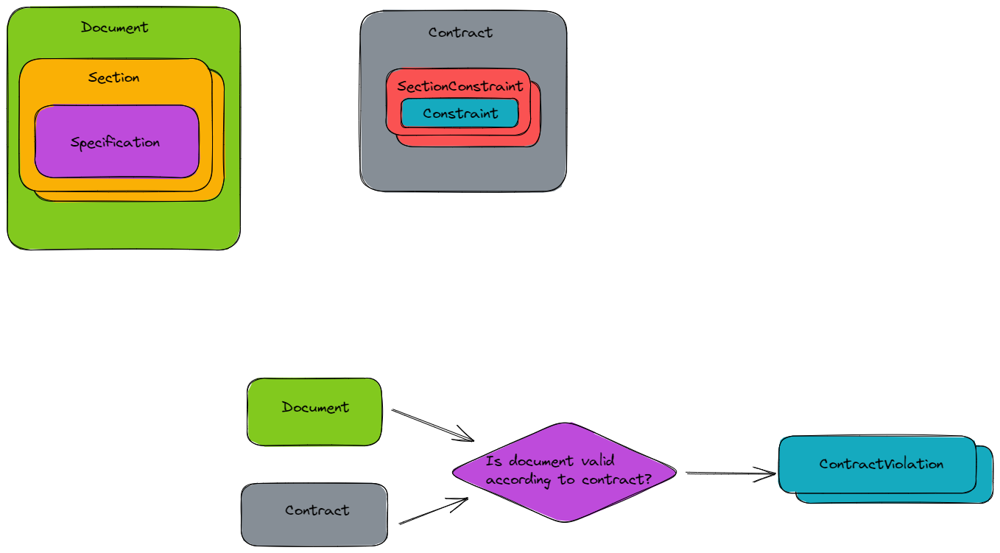
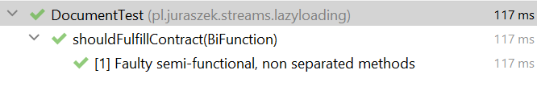
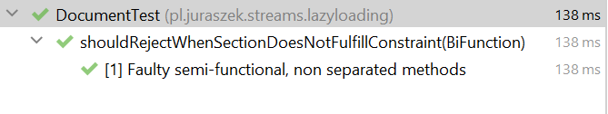
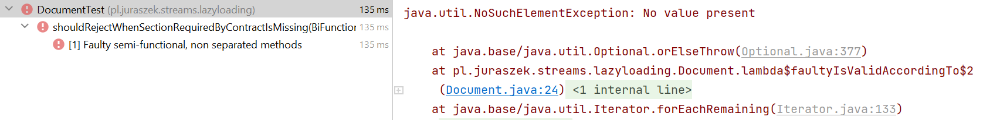
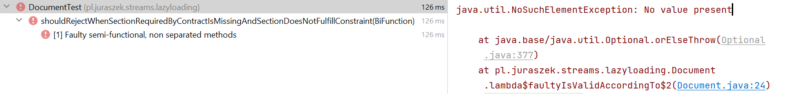
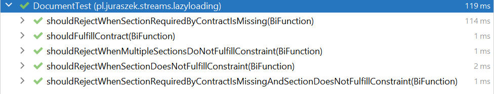

# Java streams lazy evaluation pitfall
Recently, I came across some code that did not behave as expected. After spending some time debugging and adding missing unit tests, I discovered that the reason for the faulty behavior was due to the mixing of two different programming paradigms. Current Java is no longer just a plain object-oriented language; with the great additions in version 8, it has become a multi-paradigm language with support for functional programming. API improvements, such as Java Streams, have given us many more possibilities to write our code and have opened the door to functional programming for many developers. Personally, I find these elegant functional patterns and new APIs to be the standard way of writing code. However, as with everything, there is a price to pay. In this case, the functional paradigm can help us write better code, but it can also cause unintended consequences. In my opinion, functional programming is difficult and requires practice and understanding; otherwise, it can cause more harm than good. I believe that sometimes developers do not pay enough attention to this and treat Java's functional API as just another simple improvement, without realizing how different this style of programming really is.


## Case study
Let's return to the story mentioned earlier. First, let's set up a scenario that will help us understand the problem. Let's assume that our business requirements involve modeling documents and contracts. Each document, which is made up of sections, can be validated based on a contract that has been passed. In our case, a contract is a set of rules that define constraints for specific sections in documents.



Here is the faulty code that is supposed to validate a document according to a given contract (Just in case you are not familiar with it, I used a functional library called `vavr` along with the standard Java Streams.):

```
public record Document(Set<Section> sections) {

   //   Faulty code
   public Stream<ContractViolation> faultyIsValidAccordingTo(Contract contract) {
      return Try.of(() -> contract.sectionConstraints()
                  .stream()
                  .map(sectionConstraint -> sections().stream()
                        .filter(section -> section.name().equals(sectionConstraint.sectionName()))
                        .map(section -> Tuple.of(section, sectionConstraint.constraint()))
                        .findAny()
                        .orElseThrow())
                  .filter(sectionValidation -> !sectionValidation._1.isSpecValid(sectionValidation._2))
                  .map(invalidSectionValidation -> new ContractViolation("SECTION_CONSTRAINT_VIOLATION",
                        String.format("Specification %s not valid according to section constraint %s",
                              invalidSectionValidation._1, invalidSectionValidation._2))))
            .getOrElseGet(throwable -> Stream.of(new ContractViolation("SECTION_MISSING",
                  String.format("Provided document %s does not contain section required by contract %s", this,
                        contract))));

   }
}
```

### Testing correctness
To ensure that the code performs as expected, I added several unit tests. 
The first test checks the 'happy path' scenario, where the given document successfully passes the contract.

```

  private static Stream<Arguments> validationMethods() {
      BiFunction<Document, Contract, Stream<ContractViolation>> faultyIsValidAccordingTo = Document::faultyIsValidAccordingTo;
      return Stream.of(
            Arguments.of(Named.of("Faulty semi-functional, non separated methods",faultyIsValidAccordingTo)),
      );
   }
   
   @ParameterizedTest
   @MethodSource("validationMethods")
   void shouldFulfillContract(BiFunction<Document, Contract, Stream<ContractViolation>> validationMethod) {
      //      given
      var contract = new Contract(Set.of(new SectionConstraint("Introduction", new SizeLimit(20)),
            new SectionConstraint("Body", new SizeLimit(500)), new SectionConstraint("Conclusion", new SizeLimit(20))));
      var document = new Document(
            Set.of(new Section("Introduction", "Lorem ipsum dolor sit amet, consectetur adipiscing elit."),
                  new Section("Body",
                        "Sollicitudin tempor id eu nisl nunc mi. Ut ornare lectus sit amet est placerat. Viverra maecenas accumsan lacus vel facilisis volutpat est velit egestas."),
                  new Section("Conclusion", "Et magnis dis parturient montes nascetur ridiculus mus mauris. ")));
      //  when
      Stream<ContractViolation> validationResult = validationMethod.apply(document, contract);

      //      then
      assertThat(validationResult).isEmpty();
   }
   

```



The test passed, which is a good start. Now, what about the cases where validation fails?

```
   @ParameterizedTest
   @MethodSource("validationMethods")
   void shouldRejectWhenSectionDoesNotFulfillConstraint(
         BiFunction<Document, Contract, Stream<ContractViolation>> validationMethod) {
      //      given
      var contract = new Contract(Set.of(new SectionConstraint("Introduction", new SizeLimit(20)),
            new SectionConstraint("Body", new SizeLimit(10)), new SectionConstraint("Conclusion", new SizeLimit(20))));
      var document = new Document(
            Set.of(new Section("Introduction", "Lorem ipsum dolor sit amet, consectetur adipiscing elit."),
                  new Section("Body",
                        "Sollicitudin tempor id eu nisl nunc mi. Ut ornare lectus sit amet est placerat. Viverra maecenas accumsan lacus vel facilisis volutpat est velit egestas."),
                  new Section("Conclusion", "Et magnis dis parturient montes nascetur ridiculus mus mauris. ")));
      //  when
      Stream<ContractViolation> validationResult = validationMethod.apply(document, contract);

      //      then
      assertThat(validationResult).map(ContractViolation::id).containsExactlyInAnyOrder("SECTION_CONSTRAINT_VIOLATION");
   }
```



In this case logic also behaves as expected.

```
   @ParameterizedTest
   @MethodSource("validationMethods")
   void shouldRejectWhenSectionRequiredByContractIsMissing(
         BiFunction<Document, Contract, Stream<ContractViolation>> validationMethod) {
      //      given
      var contract = new Contract(Set.of(new SectionConstraint("Introduction", new SizeLimit(20)),
            new SectionConstraint("Body", new SizeLimit(100)), new SectionConstraint("Conclusion", new SizeLimit(20))));
      var document = new Document(
            Set.of(new Section("Introduction", "Lorem ipsum dolor sit amet, consectetur adipiscing elit."),
                  new Section("Body",
                        "Sollicitudin tempor id eu nisl nunc mi. Ut ornare lectus sit amet est placerat. Viverra maecenas accumsan lacus vel facilisis volutpat est velit egestas.")));
      //  when
      Stream<ContractViolation> validationResult = validationMethod.apply(document, contract);

      //      then
      assertThat(validationResult).map(ContractViolation::id).containsExactlyInAnyOrder("SECTION_MISSING");
   }
```



Unfortunately, the test failed in that scenario. 
We expected to get a `SECTION_MISSING` violation because we
put a `try catch` in the code. 
So, what happened? Why did the code only throw an exception during 
the assertion phase, thus bypassing the catch?

```
   @ParameterizedTest
   @MethodSource("validationMethods")
   void shouldRejectWhenSectionRequiredByContractIsMissingAndSectionDoesNotFulfillConstraint(
         BiFunction<Document, Contract, Stream<ContractViolation>> validationMethod) {
      //      given
      var contract = new Contract(Set.of(new SectionConstraint("Introduction", new SizeLimit(20)),
            new SectionConstraint("Body", new SizeLimit(10)), new SectionConstraint("Conclusion", new SizeLimit(20))));
      var document = new Document(
            Set.of(new Section("Introduction", "Lorem ipsum dolor sit amet, consectetur adipiscing elit."),
                  new Section("Body",
                        "Sollicitudin tempor id eu nisl nunc mi. Ut ornare lectus sit amet est placerat. Viverra maecenas accumsan lacus vel facilisis volutpat est velit egestas.")));
      //  when
      Stream<ContractViolation> validationResult = validationMethod.apply(document, contract);

      //      then
      assertThat(validationResult).map(ContractViolation::id)
            .containsExactlyInAnyOrder("SECTION_MISSING", "SECTION_CONSTRAINT_VIOLATION");
   }
```



Another test has failed, revealing that when an `SECTION_MISSING` 
exception occurs, our entire logic breaks.
In many cases, we do not want the validation process to halt at the 
first error because there may be more errors that need to be identified.
This is additionally inconsistent because, in the case 
of `SECTION_CONSTRAINT_VIOLATION`, we do not skip processing.

### Procedural approach

Let's begin by rewriting the code in a more procedural
style to aid our understanding of the logic.

```
      public Stream<ContractViolation> proceduralIsValidAccordingTo(Contract contract) {
      Set<ContractViolation> violations = new HashSet<>();

      for (var sectionConstraint : contract.sectionConstraints()) {
         try {
            var section = findSectionInDocumentBy(sectionConstraint);
            if (filterInvalidSection(section)) {
               violations.add(sectionConstraintViolation(section));
            }
         } catch (Exception throwable) {
            violations.add(missingSectionViolation(contract));
         }
      }
      return violations.stream();
   }

```



What I did here was a simple modularization of the code. I separated the logic into several methods and used typical procedural constructs such as loops, set mutation within a loop, and exception throwing in a clear and explicit way. This new code is much easier to read and follows the conventions of its own paradigm. More importantly, it works as expected. We can even improve it further by removing the exception throwing, which is generally not recommended for handling domain logic.


```
   public Stream<ContractViolation> refactoredProceduralIsValidAccordingTo(Contract contract) {
      Set<ContractViolation> violations = new HashSet<>();

      for (var sectionConstraint : contract.sectionConstraints()) {

         var sectionOpt = findSectionInDocBy(sectionConstraint);

         if (sectionOpt.isEmpty()) {
            violations.add(missingSectionViolation(contract));
         } else {
            var section = sectionOpt.get();

            if (filterInvalidSection(section)) {
               violations.add(sectionConstraintViolation(section));
            }
         }
      }
      return violations.stream();
   }
```

Sometimes it is enough to write the code in a simpler procedural 
style, and there may not be a compelling reason to use more 
complex functional approach.

### Functional approach

Although procedural code may be simpler to write, it can quickly become convoluted 
with excessive mutation and tight coupling. When dealing with complex logic,
it's often beneficial to utilize the functional paradigm, which emphasizes modularization 
and loose coupling. Despite its stricter rules, following functional principles can lead 
to more understandable and straightforward code in the long run. Prioritizing readability 
and extensibility can ultimately save time and resources during maintenance and development.
Additionally, functional programming is not limited to the Java Streams API, and can be applied
in various frameworks and contexts, such as writing reactive code with the Reactor library, 
streaming systems with the Kafka Streams API, or Spark pipelines. Understanding the concept
of Monads, a powerful tool used in functional programming, can be invaluable in these contexts.

That being said, let's attempt to rewrite the code in a fully functional and cleaner version.

Looking at the original code, we can see that it was intended to be functional. However, it is faulty and quite difficult to read. The main problem with this code is that it mixes two paradigms: procedural and functional.
It's easier when we can assume that code which seems functional follows functional rules, but in this case, the mixing of paradigms is precisely why the code is failing and hard to read.

When we analyze the code, we can see that it breaks the pure functions rule because it has side effects, which are throwing exceptions. Another critical aspect of functional programming is modularity. We aim to have as many separate functions as possible that we can reason about in isolation and easily combine with each other. Without that separation, code can quickly become challenging to read. For example, it is a good practice to avoid inline lambdas. Very often, we can split complex streams into method chunks that can have descriptive names.

```
   public Stream<ContractViolation> faultyRefactoredIsValidAccordingTo(Contract contract) {
      return Try.of(() -> contract.sectionConstraints()
                  .stream()
                  .map(this::findSectionInDocumentBy)
                  .filter(this::filterInvalidSection)
                  .map(this::sectionConstraintViolation))
            .getOrElseGet(throwable -> Stream.of(missingSectionViolation(contract)));

   }
   
      private Tuple2<Section, Constraint> findSectionInDocumentBy(SectionConstraint sectionConstraint) {
      return sections().stream()
            .filter(sectionConstraint::matches)
            .map(section -> Tuple.of(section, sectionConstraint.constraint()))
            .findAny()
            .orElseThrow();
   }
   
```

I made some improvements to the code by separating certain parts of it into new methods 
with more descriptive names, which helped a little bit in terms of readability. 
However, our code is still failing. The reason for this is that Streams are lazily evaluated. 
All the logic inside our lambdas is executed only when we call a terminal operation on our stream. 
This happens long after our validation method call, which is why the try-catch block is completely 
skipped and the exception is thrown during the assertion phase when we try to consume the stream.
This laziness may not seem particularly useful, but it has huge benefits when it comes to processing 
larger data. We are able to calculate only the required data at the latest possible moment,
which allows us to skip the unnecessary computations.

```
   public Stream<ContractViolation> isValidAccordingTo(Contract contract) {
      return contract.sectionConstraints()
            .stream()
            .flatMap(
                  constraint -> findSectionInDocument(constraint)
                        .map(this::validateSection)
                        .getOrElseGet(Stream::of));
   }
   
      private Either<ContractViolation, Tuple2<Section, Constraint>> findSectionInDocument(
         SectionConstraint sectionConstraint) {
      return sections().stream()
            .filter(sectionConstraint::matches)
            .map(section -> Tuple.of(section, sectionConstraint.constraint()))
            .findAny()
            .map(Either::<ContractViolation, Tuple2<Section, Constraint>>right)
            .orElseGet(() -> Either.left(missingSectionViolation(sectionConstraint)));
   }
```

We no longer throw exceptions in this code. Instead, we treat exceptions the same way as
correct data by returning them using return statements in methods. 
This makes the code more readable and eliminates the need to worry about any side effects. 
The function return signature is the only thing we need to be concerned about. 
In the above examples, I used the `Vavr` library which extends the functional Java API. Unfortunately, 
the current standard API lacks some useful functional constructs, therefore I recommend using it.

## Conclusion

Simply viewing the functional paradigm as just a way to rewrite loops in Java in a more concise manner
is a mistake. 
The Streams API is a powerful tool that requires a deep understanding and practice.
Additionally, functional programming differs in many aspects and has its own rules, which can 
sometimes conflict with other paradigms.
As a result, carelessly mixing those paradigms can lead to more problems than they were intended to solve.


